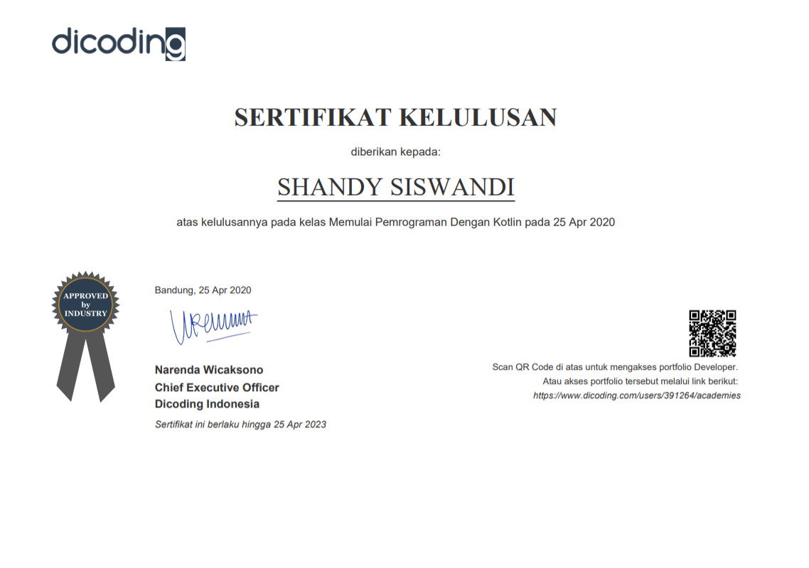

# Memulai Pemrograman dengan Kotlin

Repository ini memuat daftar contoh kode dan latihan yang ada pada kelas **Memulai Pemrograman dengan Kotlin**

**Catatan :** Parent folder di repository ini menggunakan IDE : IntelliJ IDEA

## Link Course

https://www.dicoding.com/academies/80

## Sertifikat

